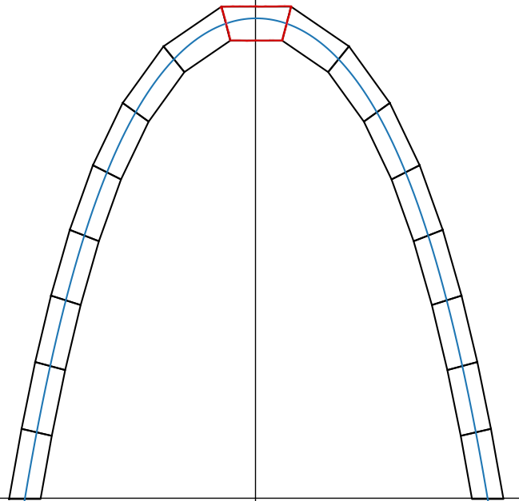

# Frei stehender Bogen (aus 3D-gedruckten Klötzen)

Hier findet man Dateien, welche im Zuge einer Facharbeit zur mathematischen Kettenlinie entstanden sind.
In dieser wurde ein frei stehender Bogen aus 3D gedruckten Klötzen konstruiert.

Die Python Datei (Kettenlinie.py) erzeugt die für den Druck benötigten stl-Dateien (bei vorgegebenen Parametern) und simuliert die Klötze zweidimensional (siehe Abbildung).

Ein Jupyter-Notebook mit dem Python Code und weiterer Programm Dokumentation finden Sie [hier](https://andreas-di.github.io/jupyter/lab/index.html?path=Kettenlinie.ipynb).

Die stl-Dateien sind fertig druckbar, für einen Bogen der Länge 68cm, der Breite 30cm (am Boden). Insgesamt besteht die hier beschriebene Bogen aus 17 Klötzen, die jeweils ca. 4cm lang sind und einen Querschnitt von 2cmx2cm haben.